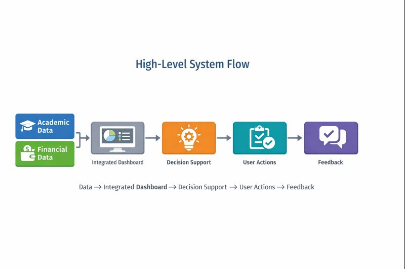

## My Concept
### AI-Enhanced Student Success System (Enterprise System Kampus)

Di era Artificial Intelligence, tantangan terbesar bukan lagi “kurang informasi”, melainkan **kebanjiran informasi**. Mahasiswa (terutama mahasiswa IT) sering punya banyak sumber data: jadwal kuliah, deadline di LMS, catatan tugas, catatan pengeluaran harian, sampai target akademik pribadi. Masalahnya, data itu tersebar, tidak terhubung, dan akhirnya tidak membantu saat harus mengambil keputusan harian: *hari ini fokus apa? minggu ini berat atau tidak? pengeluaran aman atau kebablasan?*

Konsep masterpiece yang ingin aku bangun adalah sebuah **enterprise system kampus** yang bertindak sebagai “jembatan” antara data akademik dan data finansial mahasiswa, untuk menghasilkan **arah tindakan** yang sederhana dan mudah dipakai. Bukan sistem yang membuat mahasiswa “lebih sibuk”, tetapi sistem yang membuat keputusan harian menjadi lebih ringan.

---

## Tujuan Sistem (What this system is for)

Sistem ini dirancang untuk membantu mahasiswa melakukan 3 hal inti:

1. **Menyatukan konteks akademik dan finansial dalam satu tempat**  
   Mahasiswa tidak perlu membuka banyak aplikasi/halaman berbeda untuk memahami kondisi minggu berjalan.

2. **Mengubah data menjadi arah tindakan yang jelas**  
   Dari sekadar daftar deadline dan catatan pengeluaran menjadi rencana yang bisa dieksekusi.

3. **Mendukung konsistensi hidup mahasiswa**  
   Agar beban akademik bisa terkelola tanpa membuat kondisi finansial berantakan, dan sebaliknya.

> Fokus utama konsep ini adalah: **usability (mudah dipakai)** dan **impact sosial (membantu stabilitas mahasiswa)**.

---

## Pengguna dan “Lingkup Enterprise” (Who is it for)

Walaupun target pengguna utamanya adalah mahasiswa, konsep ini tetap disebut **enterprise system** karena melibatkan struktur organisasi kampus dan peran-peran yang berbeda.

**Primary user:**
- Mahasiswa (terutama mahasiswa IT) yang punya beban akademik dinamis dan pengeluaran yang sering “bocor” tanpa sadar.

**Secondary stakeholders (bukan fokus UI utama, tapi relevan untuk enterprise):**
- Dosen / asisten (sebagai sumber data akademik di LMS/portal)
- Admin akademik (pemilik sistem portal akademik)
- Unit kemahasiswaan atau konseling (opsional, hanya bila mahasiswa memilih untuk berbagi ringkasan tertentu)

Catatan penting: konsep ini tidak bertujuan menjadi “sistem pengawas”, melainkan sistem pendukung. **Mahasiswa tetap pemilik data pribadinya.**

---

## Masalah yang Disasar (Problem Definition)

Agar konsep ini tidak terlalu umum, aku membatasi masalah yang ingin diselesaikan menjadi kombinasi yang sering terjadi:

### A) Akademik: overload itu sering tidak terlihat sampai terlambat
Mahasiswa biasanya sadar “minggu ini berat” ketika sudah mepet deadline.

### B) Finansial: kebocoran pengeluaran itu kecil tapi konsisten
Banyak pengeluaran kecil (makan, kopi, ojek, subscription) yang tidak terasa hari ini, tapi berdampak di akhir bulan.

### C) Keduanya saling memperparah
Saat tugas menumpuk, pengeluaran cenderung naik (makan cepat, pesan antar, transport). Saat uang menipis, stres naik dan produktivitas turun. Siklus ini yang ingin “dipatahkan” dengan sistem yang terintegrasi.

---

## Batasan Konsep (Scope & Non-Scope)

Agar sistemnya realistis dan tidak melebar, ini batasannya:

### Scope (yang masuk konsep)
- Integrasi data akademik dari **portal/LMS kampus** (jadwal, deadline, informasi tugas/kuis).
- Pencatatan data finansial melalui **input sederhana** (manual entry atau impor data yang sederhana).
- Menyediakan **ringkasan kondisi** dan **arah tindakan** berbasis data terintegrasi.

### Non-scope (yang sengaja tidak dikerjakan)
- Tidak menjadi aplikasi e-wallet / bank.
- Tidak otomatis menarik data sensitif tanpa izin.
- Tidak menjanjikan “AI menyelesaikan tugas”.
- Tidak menggantikan peran dosen, wali, atau konselor.

Dengan batasan ini, konsep masterpiece tetap fokus sebagai **Sistem Informasi + AI sebagai penguat**, bukan AI sebagai pusat segalanya.

---

## Model Konsep: Dari Data → Insight → Action

Konsep sistem ini mengikuti alur sederhana:

1. **Collect** — mengumpulkan data akademik dan finansial yang relevan  
2. **Organize** — menyatukan dalam struktur yang konsisten  
3. **Understand** — mengubahnya menjadi ringkasan kondisi  
4. **Act** — menghasilkan arah tindakan yang bisa dipilih pengguna  
5. **Reflect** — pengguna memberi feedback untuk penyesuaian sistem

Kalau digambarkan, alurnya seperti:  
**Data → Ringkasan Mingguan → Decision Support → Pilihan User → Feedback**

{width=100%}

---

## Tiga Modul Inti (Conceptual Modules)

Untuk menjaga konsep tetap konkret, sistem ini dibagi menjadi 3 modul inti.

1) Academic Context Module
Mengambil konteks akademik: jadwal, deadline, dan aktivitas akademik dalam minggu berjalan.

Output konsep modul ini:
- “Peta beban akademik” dalam bentuk ringkasan minggu (tanpa perlu membuka semua halaman LMS satu per satu).

2) Financial Context Module
Mengambil konteks finansial yang relevan: pemasukan (jika ada), pengeluaran harian, dan kategori pengeluaran.

Output konsep modul ini:
- “Gambaran kondisi finansial minggu ini” yang cukup untuk mengambil keputusan (bukan laporan akuntansi lengkap).

3) Decision Support Layer (AI-Enhanced)
Lapisan ini menghubungkan dua konteks di atas agar sistem bisa memberi arah yang nyambung dengan realita hidup mahasiswa.

Output konsep modul ini:
- Arah tindakan yang “masuk akal” berdasarkan kondisi akademik **dan** finansial.

{width=100%}

---

## Prinsip Desain: Usability First

Konsep ini berdiri di atas beberapa prinsip desain agar tidak menjadi sistem yang “berat dipakai”:

1. **Minimum input, maximum clarity**  
   Input dibuat sekecil mungkin. Yang ditampilkan harus benar-benar membantu keputusan.

2. **Single place to decide**  
   Mahasiswa cukup melihat satu dashboard ringkas untuk menentukan langkah minggu ini.

3. **Default sederhana, detail opsional**  
   Tampilan awal ringkas, detail bisa dibuka jika diperlukan.

4. **Kontrol ada di pengguna**  
   Mahasiswa dapat memilih apa yang dicatat, apa yang dibagikan, dan apa yang disarankan.

---

## Definisi “Masterpiece” dalam Konsep Ini

Masterpiece bagiku bukan sekadar teknologi AI terbaru, tetapi **sistem yang benar-benar dipakai** karena membantu kehidupan pengguna.

Jika sistem ini berhasil, maka diharapkan mahasiswa:  
- lebih mudah melihat kondisi mingguannya,  
- lebih mudah mengambil keputusan tanpa stres berlebih,  
- lebih mudah menjaga stabilitas finansial sambil tetap mengejar target akademik.

<!-- TODO: TARUH GAMBAR 3 DI SINI
Deskripsi: "Scope vs Non-Scope" — infografik dua kolom: In Scope (✅) dan Out of Scope (❌).
Saran format: tabel ringkas atau poster checklist.
Contoh pemakaian:
{fig-alt="Scope vs Non-Scope" fig-cap="Batasan konsep agar sistem tetap fokus dan realistis."}
-->
