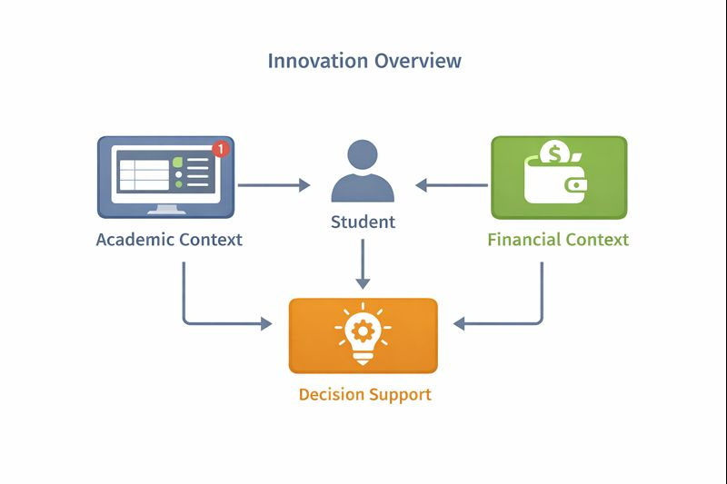

## My Innovations
> From Concept to a Concrete System Idea

Setelah mendefinisikan konsep dan posisi pandanganku terhadap AI, bagian ini berfokus pada **inovasi sistem konkret** yang merepresentasikan *masterpiece* versiku. Inovasi ini tidak dimaksudkan sebagai produk akhir yang sempurna, melainkan sebagai **desain solusi yang realistis, terarah, dan relevan** dengan kehidupan mahasiswa.

Inovasi yang aku ajukan adalah sebuah **AI-Enhanced Student Success System**, yaitu enterprise system kampus yang membantu mahasiswa **menjaga stabilitas akademik dan finansial** melalui rekomendasi yang praktis dan mudah ditindaklanjuti.

---

## Gambaran Umum Inovasi

Sistem ini dirancang sebagai **decision-support system**, bukan sistem yang mengatur atau memaksa. Tujuannya adalah membantu mahasiswa menjawab pertanyaan sederhana namun krusial, seperti:  
- *Minggu ini aku harus fokus ke apa?*  
- *Apakah kondisi pengeluaranku masih aman jika beban tugas meningkat?*  
- *Keputusan apa yang paling masuk akal dengan kondisi yang ada sekarang?*  

Inovasi ini memanfaatkan AI bukan untuk “menjadi pintar”, tetapi untuk **menghubungkan konteks akademik dan finansial** agar mahasiswa bisa mengambil keputusan dengan lebih sadar.

{width=100%}

---

## Masalah Spesifik yang Diselesaikan

Agar inovasi ini tidak terlalu umum, aku membatasi masalah yang ingin disasar menjadi **satu kombinasi inti**:

> **Mahasiswa kesulitan mengambil keputusan harian karena beban akademik dan kondisi finansial dianalisis secara terpisah.**

Akibatnya:  
- prioritas tugas sering tidak realistis,  
- pengeluaran meningkat saat beban akademik tinggi,  
- stres meningkat karena tidak ada gambaran kondisi yang utuh.  

Inovasi ini berusaha menyelesaikan masalah tersebut dengan **menghadirkan satu titik pengambilan keputusan** yang mempertimbangkan kedua aspek sekaligus.

---

## Cara Kerja Sistem (High-Level Workflow)

Secara garis besar, sistem ini bekerja dalam 4 tahap:

1. **Mengumpulkan konteks akademik**  
   Data seperti jadwal, deadline, dan aktivitas akademik minggu berjalan.

2. **Mengumpulkan konteks finansial**  
   Data pengeluaran dan pemasukan yang dicatat secara sederhana oleh pengguna.

3. **Menganalisis kondisi gabungan**  
   AI membantu mengidentifikasi pola beban dan potensi risiko (overload atau overspending).

4. **Memberikan rekomendasi tindakan**  
   Sistem menyarankan langkah yang bisa dipilih atau dimodifikasi oleh mahasiswa.

Sistem tidak mengeksekusi keputusan, melainkan **menawarkan opsi yang masuk akal**.

<!-- TODO: TARUH GAMBAR 2 DI SINI
Deskripsi: "System Workflow" — flowchart 4 tahap:
Academic Context + Financial Context → Analysis → Recommendations → User Choice.
Saran format: flowchart horizontal dengan panah sederhana.
Contoh pemakaian:
{fig-alt="System workflow" fig-cap="Alur kerja inovasi dari konteks hingga rekomendasi."}
-->

---

## Bentuk Rekomendasi yang Diberikan

Salah satu aspek inovatif dari sistem ini adalah **bentuk rekomendasinya**, yang dibuat agar:   
- tidak terlalu panjang,  
- tidak menggurui,  
- mudah dieksekusi.

Contoh bentuk rekomendasi:  
- prioritas tugas mingguan yang disesuaikan dengan waktu dan energi,  
- peringatan pengeluaran dengan alternatif yang lebih aman,  
- saran penyesuaian rencana jika beban meningkat tiba-tiba.  

Rekomendasi selalu bersifat **opsional dan transparan**, sehingga pengguna tetap memegang kendali penuh.

---

## Keunikan Inovasi Dibanding Sistem Serupa

Inovasi ini berbeda dari:  
- aplikasi to-do list biasa,  
- aplikasi pencatat keuangan,  
- atau chatbot AI generik.  

Keunikannya terletak pada:
1. **Integrasi konteks akademik dan finansial** dalam satu sistem.  
2. **Fokus pada decision support**, bukan otomatisasi penuh.  
3. **Usability sebagai prioritas utama**, bukan kelengkapan fitur.  
4. **Pendekatan enterprise**, sehingga sistem bisa diintegrasikan dengan infrastruktur kampus.  

---

## Dampak yang Diharapkan

Jika sistem ini diterapkan dan digunakan secara konsisten, dampak yang diharapkan antara lain:
- mahasiswa lebih sadar terhadap kondisi mingguannya,
- pengambilan keputusan menjadi lebih terencana,
- tekanan akademik dan finansial dapat diminimalkan,
- dan mahasiswa merasa lebih memiliki kontrol atas kehidupannya sendiri.

Dampak ini tidak diukur dari seberapa canggih AI yang digunakan, tetapi dari **seberapa besar sistem ini benar-benar membantu mahasiswa**.

---

## Batasan dan Ruang Pengembangan

Sebagai inovasi awal, sistem ini tentu memiliki batasan:
- masih bergantung pada kejujuran input pengguna,
- belum menggantikan peran konselor atau dosen wali,
- dan perlu iterasi berkelanjutan untuk menyesuaikan kebutuhan nyata mahasiswa.

Namun justru di sinilah ruang pengembangan terbuka, baik dari sisi teknologi maupun desain sistem di masa depan.

<!-- TODO: TARUH GAMBAR 4 DI SINI
Deskripsi: "Future Growth" — ilustrasi roadmap sederhana:
v1 (core decision support) → v2 (better personalization) → v3 (campus-wide integration).
Saran format: roadmap 3 tahap.
Contoh pemakaian:
{fig-alt="Future roadmap" fig-cap="Ruang pengembangan inovasi di masa depan."}
-->

---

## Penutup

Melalui inovasi ini, aku ingin menunjukkan bahwa penerapan AI dalam sistem dan teknologi informasi tidak harus berskala besar atau kompleks untuk memberikan dampak. Dengan fokus pada **konteks pengguna, usability, dan dampak sosial**, sebuah sistem dapat menjadi *masterpiece* yang bermakna bagi penggunanya.
