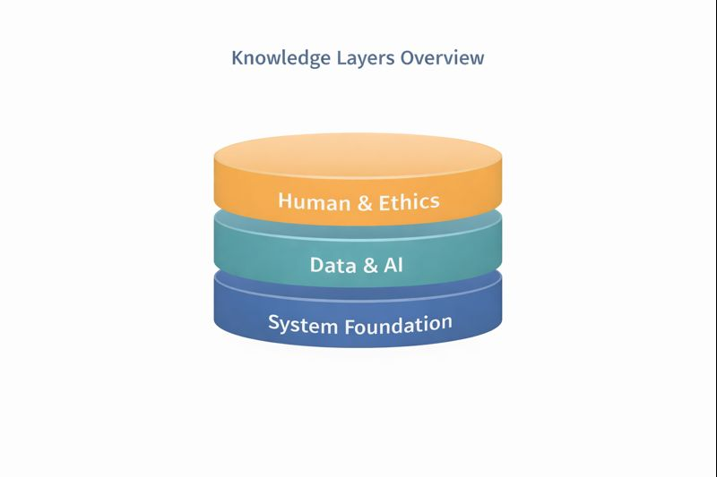

## My Knowledge
> *Knowledge as the Foundation of My Masterpiece*

Sebuah inovasi tidak berdiri hanya dari ide, tetapi dari **pengetahuan yang menopangnya**. Pada bagian ini, aku memetakan pengetahuan yang relevan dengan *AI-Enhanced Student Success System* yang aku gagas sebelumnya.

My Knowledge bukan daftar semua hal yang aku tahu, melainkan **peta kemampuan dan pemahaman** yang secara langsung memungkinkan sistem tersebut dirancang, dibangun, dan dikembangkan secara realistis.

---

## Cara Pandang terhadap Knowledge

Aku memandang knowledge sebagai sesuatu yang **berlapis dan saling terhubung**, bukan sekadar kumpulan mata kuliah atau tools. Dalam konteks sistem berbasis AI untuk mahasiswa, pengetahuan harus menjawab tiga pertanyaan utama:

1. Bagaimana sistem ini dirancang dan diintegrasikan?  
2. Bagaimana data diolah menjadi insight yang berguna?  
3. Bagaimana sistem tetap manusiawi dan dapat dipercaya?

Dari sini, knowledge-ku aku kelompokkan menjadi beberapa lapisan inti.

{width=100%}

---

## System & Enterprise Foundation

Lapisan pertama adalah pemahaman tentang **sistem dan enterprise architecture**, karena inovasi yang aku rancang tidak berdiri sebagai aplikasi kecil, tetapi sebagai bagian dari sistem kampus.

Pengetahuan yang relevan:  
- Konsep **sistem informasi** dan alur bisnis (workflow).  
- Pemahaman tentang **enterprise system**: peran, hak akses, dan integrasi antar sistem.  
- Requirement analysis dan pemodelan sistem.  
- Pemisahan antara frontend, backend, dan data layer.  

Pengetahuan ini memastikan bahwa sistem yang dirancang:  
- tidak bertabrakan dengan sistem kampus yang sudah ada,  
- dapat dikembangkan secara bertahap,  
- dan tetap maintainable dalam jangka panjang.  

---

## Data Management & Information Flow

Lapisan kedua berfokus pada **data sebagai fondasi keputusan**. Tanpa pengelolaan data yang baik, AI tidak akan menghasilkan rekomendasi yang bermakna.

Pengetahuan inti di lapisan ini meliputi:  
- Dasar **basis data** dan pemodelan data.  
- Alur data dari input hingga visualisasi (ETL sederhana).  
- Validasi dan konsistensi data.  
- Perancangan data yang mendukung ringkasan, bukan sekadar penyimpanan.  

Dalam sistem yang aku rancang, data bukan untuk dianalisis secara akademik semata, tetapi untuk **mendukung keputusan cepat dan kontekstual**.

<!-- TODO: TARUH GAMBAR 2 DI SINI
Deskripsi: "Data Flow for Decision Support" — diagram alur data:
Input → Storage → Processing → Summary → Decision.
Saran format: flow diagram sederhana dengan ikon data.
Contoh pemakaian:
{fig-alt="Data flow" fig-cap="Alur data dari input hingga menjadi dasar pengambilan keputusan."}
-->

---

## Artificial Intelligence as a Supporting Layer

Lapisan berikutnya adalah AI, yang aku posisikan sebagai **pendukung sistem**, bukan pusat dari keseluruhan desain.

Pengetahuan AI yang relevan dengan inovasi ini:  
- Konsep dasar machine learning dan rule-based systems.  
- Pemahaman bahwa tidak semua masalah perlu model kompleks.  
- Evaluasi hasil rekomendasi, bukan hanya akurasi model.  
- Explainability: kemampuan menjelaskan *mengapa* sistem memberi saran tertentu.  

Dengan pemahaman ini, AI digunakan untuk:
- mengenali pola beban akademik,
- mendeteksi kecenderungan pengeluaran,
- dan menghubungkan keduanya menjadi rekomendasi yang masuk akal.

---

## Human-Centered Design & Usability

Sistem yang baik secara teknis bisa gagal jika tidak dipahami penggunanya. Karena itu, lapisan knowledge berikutnya adalah **human-centered design**.

Pengetahuan yang relevan:  
- Prinsip dasar **UI/UX** untuk sistem informasi.  
- Reduksi beban kognitif pengguna.  
- Penyajian informasi secara ringkas dan visual.   
- Mendesain sistem agar pengguna tetap merasa memegang kendali.  

Lapisan ini memastikan bahwa sistem:  
- tidak terasa mengintimidasi,  
- tidak terasa seperti alat pengawasan,  
- dan benar-benar membantu pengguna dalam kehidupan sehari-hari.  

---

## Ethics, Privacy, and Responsibility

Lapisan terakhir adalah **etika dan tanggung jawab**, terutama karena sistem ini menyentuh data akademik dan finansial.

Pengetahuan yang menurutku krusial:  
- Prinsip **privacy-by-design**.  
- Opt-in dan kontrol data oleh pengguna.  
- Transparansi rekomendasi sistem.  
- Kesadaran akan bias dan keterbatasan sistem otomatis.  

Lapisan ini bukan tambahan, tetapi fondasi kepercayaan yang membuat sistem layak digunakan dalam lingkungan kampus.

---

## What I Know and What I Am Learning

Aku menyadari bahwa knowledge bersifat dinamis. Karena itu, aku memposisikan diriku sebagai pembelajar yang terus berkembang.

- **What I know:** dasar sistem informasi, data, dan pemikiran sistemik.  
- **What I am learning:** penerapan AI yang lebih kontekstual, evaluasi sistem berbasis dampak, dan desain sistem yang semakin berorientasi pada pengguna.

Kesadaran ini penting agar inovasi tidak berhenti sebagai konsep, tetapi berkembang seiring bertambahnya pemahaman dan pengalaman.

---

## Penutup

Melalui My Knowledge, aku ingin menunjukkan bahwa *masterpiece* yang aku rancang tidak muncul secara tiba-tiba. Ia dibangun di atas fondasi pengetahuan yang terstruktur, relevan, dan terus berkembang.

Dengan menggabungkan sistem, data, AI, dan pendekatan manusiawi, aku percaya bahwa teknologi informasi di era Artificial Intelligence dapat memberikan dampak nyata, terutama bagi mahasiswa seperti diriku sendiri.
